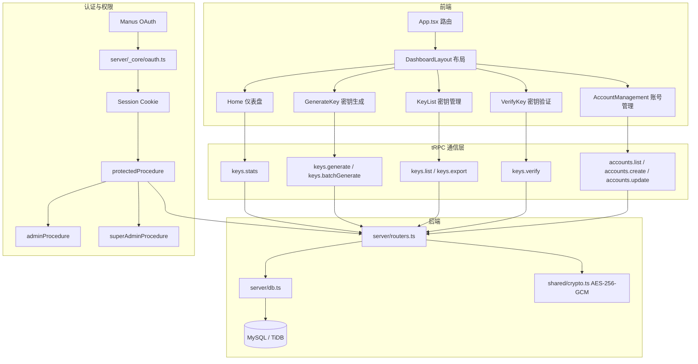

# 架构文档

> 本文档由 Manus 自动生成和维护。最后更新于：2026-03-19 15:16

## 1. 项目概述

**密钥管理系统（Key Manager）** 是一个基于 Shroom1.0 传感器项目衍生的独立 Web 应用，用于管理传感器设备的授权密钥。系统采用**三级权限体系**（超级管理员 → 管理员 → 子账号），支持两种密钥类型（**量产密钥**和**在线租赁密钥**），每个密钥仅可激活一次。核心加密算法使用 **AES-256-GCM** 模式，比原 Shroom1.0 的 AES-ECB 更安全，旧密钥不再兼容。

系统的主要功能包括密钥生成（单个/批量）、密钥解密验证、分级密钥管理、密钥导出（CSV/JSON）、账号层级管理以及使用统计等。加密模块独立可导出，支持 ESM 和 CJS 双格式，可直接在 Electron 项目中通过 `require()` 引入。

## 2. 技术栈

| 分类 | 技术 | 版本/说明 |
| :--- | :--- | :--- |
| **前端框架** | React 19 + Tailwind CSS 4 | SPA 单页应用，暗色主题 |
| **后端框架** | Express 4 + tRPC 11 | 类型安全的 RPC 通信 |
| **数据库** | MySQL / TiDB | 通过 Drizzle ORM 管理 |
| **编程语言** | TypeScript 5.9 | 前后端统一类型 |
| **包管理器** | pnpm 10 | 高效依赖管理 |
| **部署环境** | Manus Platform | 内置 OAuth 认证与托管 |
| **UI 组件库** | shadcn/ui + Radix UI | 无障碍组件体系 |
| **加密算法** | AES-256-GCM (CryptoJS) | HMAC-SHA256 认证标签，随机 IV |
| **路由** | wouter | 轻量前端路由 |
| **数据序列化** | Superjson | tRPC 数据传输 |
| **测试** | Vitest | 16 个测试用例全部通过 |

## 3. 目录结构

```
key-manager/
├── client/                     # 前端应用
│   ├── src/
│   │   ├── _core/hooks/        # 核心 hooks（useAuth）
│   │   ├── components/         # 可复用 UI 组件
│   │   │   ├── ui/             # shadcn/ui 基础组件
│   │   │   ├── DashboardLayout.tsx  # Dashboard 布局（侧边栏导航 + 权限菜单）
│   │   │   └── ErrorBoundary.tsx
│   │   ├── contexts/           # React 上下文（主题等）
│   │   ├── hooks/              # 自定义 hooks
│   │   ├── lib/                # 工具库（trpc 客户端、utils）
│   │   ├── pages/              # 页面级组件
│   │   │   ├── Home.tsx        # 仪表盘（统计卡片 + 快速操作）
│   │   │   ├── GenerateKey.tsx # 密钥生成（单个 + 批量）
│   │   │   ├── KeyList.tsx     # 密钥管理列表（筛选 + 分页 + 导出）
│   │   │   ├── VerifyKey.tsx   # 密钥验证（解密 + 详情展示）
│   │   │   ├── AccountManagement.tsx # 账号管理（创建/编辑/禁用）
│   │   │   └── NotFound.tsx    # 404 页面
│   │   ├── App.tsx             # 路由配置与布局
│   │   ├── const.ts            # 前端常量
│   │   ├── index.css           # 全局样式与暗色主题变量
│   │   └── main.tsx            # 应用入口
│   └── public/                 # 静态资源（favicon 等）
├── server/                     # 后端逻辑
│   ├── _core/                  # 框架核心（OAuth、上下文、Vite 桥接）
│   │   ├── trpc.ts             # tRPC 初始化 + 三级权限中间件
│   │   └── ...                 # 其他核心模块
│   ├── db.ts                   # 数据库查询 helpers（账号 + 密钥 CRUD）
│   ├── routers.ts              # tRPC 路由定义（keys + accounts + auth）
│   ├── storage.ts              # S3 文件存储
│   ├── crypto.test.ts          # 加密模块测试（15 个用例）
│   └── auth.logout.test.ts     # 登出测试（1 个用例）
├── drizzle/                    # 数据库 schema 与迁移
│   └── schema.ts               # users 表（三级角色）+ licenseKeys 表
├── shared/                     # 前后端共享
│   ├── crypto.ts               # AES-256-GCM 加密模块（ESM）
│   ├── crypto-lib.cjs          # AES-256-GCM 加密模块（CJS，Electron 可用）
│   ├── const.ts                # 共享常量
│   └── types.ts                # 共享类型
├── package.json
├── todo.md                     # 功能追踪
└── ARCHITECTURE.md             # 本文档
```

### 关键目录说明

| 目录/文件 | 主要功能 |
| :--- | :--- |
| `client/src/pages/` | 5 个页面组件，对应 5 个路由 |
| `client/src/components/DashboardLayout.tsx` | 侧边栏布局，根据角色动态显示菜单 |
| `server/routers.ts` | tRPC 路由，包含 keys、accounts、auth 三组 |
| `server/db.ts` | 数据库查询函数，含分级权限过滤逻辑 |
| `drizzle/schema.ts` | users 表（三级角色 + 层级关系）+ licenseKeys 表 |
| `shared/crypto.ts` | AES-256-GCM 加密核心，ESM 格式 |
| `shared/crypto-lib.cjs` | 同上，CJS 格式，供 Electron 项目 `require()` |
| `scripts/` | 跨平台启动包装脚本，统一为开发/生产入口设置 `NODE_ENV` |

## 4. 核心模块与数据流

### 4.1. 模块关系图 (Mermaid)



### 4.2. 主要数据流

**用户认证流程**：用户通过 Manus OAuth 登录，系统根据 `openId` 匹配用户记录。首次登录的 Owner 自动设为 `super_admin` 角色，后续用户由上级创建并分配角色。被禁用的账号无法登录。

**密钥生成流程**：用户选择传感器类型（14 种）、有效期天数和密钥类型（量产/租赁），后端使用 AES-256-GCM 加密生成 hex 格式密钥字符串。加密载荷为 JSON 格式 `{date, file, cat, v}`，每次加密使用随机 IV 确保唯一性。密钥元数据同步写入数据库。

**密钥激活流程**：通过 `keys.activate` API 激活密钥，每个密钥仅可激活一次。激活后记录激活时间，状态变为已激活，不可重复使用。

**分级查看流程**：超级管理员可查看所有密钥；管理员可查看自己及其下属子账号的密钥；子账号仅可查看自己创建的密钥。

**密钥验证流程**：输入密钥字符串，后端先解密验证（HMAC 认证标签校验 + JSON 解析），再查询数据库获取激活状态、创建者等附加信息。

## 5. API 端点 (Endpoints)

| 方法 | 路径 | 权限 | 描述 |
| :--- | :--- | :--- | :--- |
| `tRPC` | `auth.me` | 公开 | 获取当前登录用户信息 |
| `tRPC` | `auth.logout` | 公开 | 用户登出 |
| `tRPC` | `keys.sensorTypes` | 登录 | 获取传感器类型列表 |
| `tRPC` | `keys.generate` | 登录 | 生成单个密钥 |
| `tRPC` | `keys.batchGenerate` | 登录 | 批量生成密钥 |
| `tRPC` | `keys.list` | 登录 | 分页查询密钥列表（分级过滤） |
| `tRPC` | `keys.verify` | 登录 | 验证/解密密钥 |
| `tRPC` | `keys.activate` | 登录 | 激活密钥（仅一次） |
| `tRPC` | `keys.stats` | 登录 | 获取密钥统计数据 |
| `tRPC` | `keys.export` | 登录 | 导出密钥（CSV/JSON） |
| `tRPC` | `accounts.list` | 管理员+ | 查询下级账号列表 |
| `tRPC` | `accounts.create` | 管理员+ | 创建下级账号 |
| `tRPC` | `accounts.update` | 管理员+ | 编辑账号（名称/状态/备注） |
| `tRPC` | `system.notifyOwner` | 登录 | 向 Owner 发送通知 |

## 6. 加密模块

### 6.1. 算法说明

系统使用 **AES-256-GCM** 加密模式（通过 CryptoJS CTR 模式 + HMAC-SHA256 认证标签模拟），相比原 Shroom1.0 的 AES-ECB 具有以下优势：

| 特性 | AES-ECB（旧） | AES-256-GCM（新） |
| :--- | :--- | :--- |
| IV 随机性 | 无 IV | 每次 12 字节随机 IV |
| 认证标签 | 无 | HMAC-SHA256 前 16 字节 |
| 相同明文 | 相同密文 | 不同密文 |
| 篡改检测 | 不支持 | 支持 |

### 6.2. 密钥格式

密钥字符串为 hex 编码，结构为：`IV(24字符) + AuthTag(32字符) + Ciphertext(hex)`。

加密载荷 JSON 格式：`{"date": <到期时间戳>, "file": "<传感器类型>", "cat": "<production|rental>", "v": 2}`。

### 6.3. Electron 集成

将 `shared/crypto-lib.cjs` 复制到 Electron 项目中，通过 `require('./crypto-lib.cjs')` 引入即可使用 `decodeLicenseKey()` 函数验证密钥。依赖 `crypto-js` npm 包。

## 7. 环境变量

| 变量名 | 描述 |
| :--- | :--- |
| `DATABASE_URL` | 数据库连接字符串；未配置时登录接口会返回明确的 503 提示，默认管理员也不会创建 |
| `JWT_SECRET` | Session Cookie 签名密钥 |
| `VITE_APP_ID` | Manus OAuth 应用 ID |
| `OAUTH_SERVER_URL` | Manus OAuth 后端地址 |
| `VITE_OAUTH_PORTAL_URL` | Manus 登录门户地址 |
| `OWNER_OPEN_ID` | 项目 Owner 的 OpenID |
| `OWNER_NAME` | 项目 Owner 名称 |
| `BUILT_IN_FORGE_API_URL` | Manus 内置 API 地址 |
| `BUILT_IN_FORGE_API_KEY` | Manus 内置 API 密钥 |

## 8. 项目进度

| 完成时间 | 分支 | 完成的功能/工作 | 说明 |
| :--- | :--- | :--- | :--- |
| 2026-03-06 10:31 | main | 项目初始化 | React 19 + tRPC + Drizzle ORM 基础架构 |
| 2026-03-06 10:31 | main | 用户认证模块 | Manus OAuth 登录/登出 |
| 2026-03-06 10:31 | main | 原始密钥系统分析 | 分析 Shroom1.0 的 AES-ECB 加密逻辑 |
| 2026-03-06 21:50 | main | 数据库 schema | users 表（三级角色 + 层级关系）+ licenseKeys 表（量产/租赁 + 激活状态） |
| 2026-03-06 21:50 | main | AES-256-GCM 加密模块 | 独立可导出，ESM + CJS 双格式，Electron 可直接 require |
| 2026-03-06 21:50 | main | 三级权限中间件 | super_admin / admin / user 权限检查 |
| 2026-03-06 21:50 | main | 完整后端 API | 密钥生成/批量/验证/激活/统计/导出 + 账号管理 CRUD |
| 2026-03-06 21:50 | main | 前端全部页面 | 仪表盘、密钥生成、密钥管理、密钥验证、账号管理 5 个页面 |
| 2026-03-06 21:50 | main | 暗色主题 | 专业暗色配色方案，OKLCH 色彩空间 |
| 2026-03-06 21:50 | main | Vitest 测试 | 16 个测试用例全部通过（加密/解密/生成/解码/篡改检测） |
| 2026-03-19 15:15 | main | 跨平台启动脚本 | `pnpm dev` / `pnpm start` 改为通过包装脚本设置 `NODE_ENV`，兼容 Windows PowerShell |
| 2026-03-19 15:16 | main | 登录配置诊断 | 数据库未配置时登录接口返回明确错误，启动日志和登录页同步提示默认管理员依赖数据库初始化 |

## 9. 更新日志

| 时间 | 分支 | 变更类型 | 描述 |
| :--- | :--- | :--- | :--- |
| 2026-03-06 10:31 | main | 初始化 | 创建项目架构文档 |
| 2026-03-06 21:50 | main | 新增功能 | 完成全部核心功能：三级权限、密钥生成/验证/管理、账号管理、AES-256-GCM 加密、暗色主题 |
| 2026-03-19 15:15 | main | 配置变更 | 调整开发与生产启动脚本，移除 Unix 风格环境变量写法，兼容 Windows 启动 |
| 2026-03-19 15:16 | main | 修复缺陷 | 修正数据库未配置时登录误报“用户名或密码错误”的问题，并补充启动与界面提示 |

*变更类型：`新增功能` / `优化重构` / `修复缺陷` / `配置变更` / `文档更新` / `依赖升级` / `初始化`*

---

*此文档旨在提供项目架构的快照，具体实现细节请参考源代码。*
