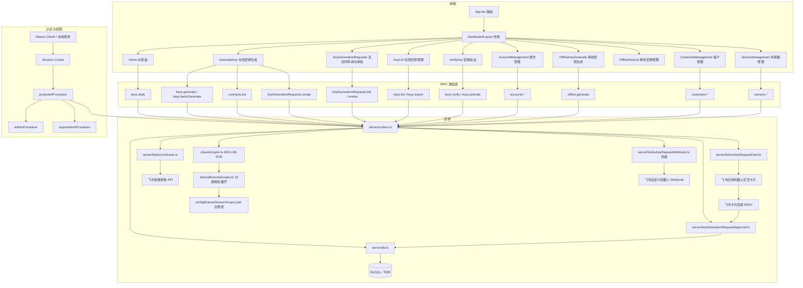

# 架构文档

> 本文档由 Manus 自动生成和维护。最后更新于：2026-07-30

## 1. 项目概述

**密钥管理系统（Key Manager）** 是一个基于 Shroom1.0 传感器项目衍生的独立 Web 应用，用于管理传感器设备的授权密钥。系统采用**三级权限体系**（超级管理员 → 管理员 → 子账号），支持两种密钥类型（**量产密钥**和**在线租赁密钥**）。密钥加密沿用 Shroom1.0 的 **AES-128/ECB** 固定密钥方案，与桌面客户端互通；授权范围支持 v3 **分类授权**（`@group:` 令牌，详见 §7.4），v1/v2 老密钥继续可解。

系统支持**在线密钥**和**离线密钥**两种模式。在线密钥采用"使用即激活"模式：后台生成密钥后发给客户，客户端通过 `keys.activate` 接口校验密钥有效性，首次调用即标记为已激活。离线密钥使用 RSA-SHA256 签名，支持机器码绑定的离线激活。

合同以飞书多维表格为唯一维护来源。合同管理页、在线/离线密钥生成页和设备码合同选择器统一通过 `contracts.list` 的 `source: "feishu"` 模式读取合同；Web 系统仅展示和绑定合同，不直接修改飞书合同数据。子账号按 `users.name` 与飞书 `提交人` 精确匹配，仅能读取同名提交人的全部合同；管理员和超级管理员可读取全部合同。

飞书合同在缓存阶段按归一化后的合同编号去重。普通账号的在线密钥必须绑定当前用户可见的飞书合同才能直接生成，客户名称由合同自动带入；无合同场景保存完整生成参数和申请原因，仅超级管理员可审批，批准时在同一数据库事务内生成密钥并更新申请状态。超级管理员可在确认弹窗选择“无合同生成”直接签发密钥，不创建审批申请。

## 2. 技术栈

| 分类 | 技术 | 版本/说明 |
| :--- | :--- | :--- |
| **前端框架** | React 19 + Tailwind CSS 4 | SPA 单页应用，浅色主题 |
| **后端框架** | Express 4 + tRPC 11 | 类型安全的 RPC 通信 |
| **数据库** | MySQL / TiDB | 通过 Drizzle ORM 管理 |
| **编程语言** | TypeScript 5.9 | 前后端统一类型 |
| **包管理器** | pnpm 10 | 高效依赖管理 |
| **部署环境** | Manus Platform | 内置 OAuth 认证与托管 |
| **UI 组件库** | shadcn/ui + Radix UI | 无障碍组件体系 |
| **加密算法** | AES-128/ECB/Pkcs7 (CryptoJS) + RSA-SHA256 | 与桌面端互通；payload 带随机 `n`，离线激活码 RSA 签名 |
| **路由** | wouter | 轻量前端路由 |
| **数据序列化** | Superjson | tRPC 数据传输 |
| **测试** | Vitest | 115 个测试用例全部通过，覆盖服务端规则、分类授权注册表与 v3 密钥、飞书通知/审批回调与按钮 DOM 稳定性 |

## 3. 目录结构

```
key-manager/
├── client/                     # 前端应用
│   ├── src/
│   │   ├── _core/hooks/        # 核心 hooks（useAuth）
│   │   ├── components/         # 可复用 UI 组件
│   │   │   ├── ui/             # shadcn/ui 基础组件（按钮文本稳定化、Portal/提示禁翻译）
│   │   │   │   └── button.test.tsx # 加载状态按钮 DOM 结构测试
│   │   │   ├── KeyGenerationGateDialog.tsx # 合同绑定/无合同直生成或申请确认弹窗
│   │   │   ├── DashboardLayout.tsx  # Dashboard 布局（侧边栏导航 + 权限菜单）
│   │   │   └── ErrorBoundary.tsx
│   │   ├── contexts/           # React 上下文（主题等）
│   │   ├── hooks/              # 自定义 hooks
│   │   ├── lib/                # 工具库（trpc 客户端、utils）
│   │   ├── pages/              # 页面级组件
│   │   │   ├── Home.tsx        # 仪表盘（统计卡片 + 快速操作）
│   │   │   ├── GenerateKey.tsx # 在线密钥生成（单个 + 批量）
│   │   │   ├── KeyGenerationRequests.tsx # 无合同申请列表与超管审批
│   │   │   ├── KeyList.tsx     # 在线密钥管理列表（筛选 + 分页 + 导出）
│   │   │   ├── VerifyKey.tsx   # 密钥验证（在线 + 离线 Tab）
│   │   │   ├── OfflineKeyGenerate.tsx # 离线密钥生成
│   │   │   ├── OfflineKeyList.tsx     # 离线密钥管理
│   │   │   ├── AccountManagement.tsx  # 账号管理
│   │   │   ├── CustomerManagement.tsx # 客户管理
│   │   │   ├── SensorManagement.tsx   # 传感器类型管理
│   │   │   ├── MacReader.tsx          # MAC 地址读取
│   │   │   └── NotFound.tsx    # 404 页面
│   │   ├── App.tsx             # 路由配置与布局
│   │   ├── const.ts            # 前端常量
│   │   ├── index.css           # 全局样式与主题变量
│   │   └── main.tsx            # 应用入口
│   └── public/                 # 静态资源（favicon 等）
├── server/                     # 后端逻辑
│   ├── _core/                  # 框架核心（OAuth、上下文、Vite 桥接）
│   │   ├── trpc.ts             # tRPC 初始化 + 三级权限中间件
│   │   └── ...                 # 其他核心模块
│   ├── db.ts                   # 数据库查询 helpers（账号 + 密钥 CRUD）
│   ├── routers.ts              # tRPC 路由定义（keys + accounts + auth + sensors + customers + offline）
│   ├── feishuContracts.ts       # 飞书合同读取、字段映射、编号去重和提交人过滤
│   ├── feishuContracts.test.ts  # 飞书合同去重与权限范围测试
│   ├── feishuKeyRequestWebhook.ts # 无合同密钥申请飞书机器人通知
│   ├── feishuKeyRequestWebhook.test.ts # Webhook 格式、失败隔离与安全校验测试
│   ├── feishuKeyRequestCard.ts # 飞书应用机器人审批卡片构建与发送
│   ├── feishuKeyRequestCardCallback.ts # 卡片回调解密、验签、群权限校验与响应
│   ├── keyGenerationRequestApproval.ts # 网站和飞书共用的申请审批服务
│   ├── onlineKeyGeneration.ts  # 在线密钥记录准备与生成
│   ├── keyGeneration.contractRequirement.test.ts # 在线生成合同必填测试
│   ├── licenseRegistry.ts      # 分类授权注册表磁盘加载 + SHA-256 + fail-fast 校验
│   ├── licenseScopes.test.ts   # 注册表校验、令牌解析、5 种授权范围展开测试
│   ├── cryptoLibParity.test.ts # crypto-lib.cjs 与 crypto.ts 的注册表/密钥互通一致性
│   ├── storage.ts              # S3 文件存储
│   ├── crypto.test.ts          # 加密模块 + v3 分类授权 + v1/v2 向后兼容测试
│   └── auth.logout.test.ts     # 登出测试（1 个用例）
├── config/
│   └── licenseSensorGroups.json # 分类与系统归属的唯一数据源（由桌面端同步，SHA-256 对齐）
├── drizzle/                    # 数据库 schema 与迁移
│   ├── schema.ts               # 含 licenseKeys、keyGenerationRequests 等业务表
│   ├── 0010_key_generation_requests.sql # 无合同申请与密钥关联迁移
│   ├── 0011_key_soft_delete_columns.sql # 在线/离线密钥软删除字段兼容迁移
│   └── 0012_departments_table_compat.sql # 历史数据库部门表兼容迁移
├── shared/                     # 前后端共享
│   ├── crypto.ts               # AES-128-ECB 密钥生成/解码模块（ESM）
│   ├── crypto-lib.cjs          # 同上的自包含 CJS 副本（Electron 可 require）
│   ├── licenseScopes.ts        # 分类授权纯逻辑：注册表校验、@group: 令牌、范围展开
│   ├── const.ts                # 共享常量
│   └── types.ts                # 共享类型
├── obsidian-note-skill/        # 可上传的 Obsidian 笔记 skill 源目录
│   └── obsidian-note/
│       ├── SKILL.md             # 层级笔记生成与自动保存工作流
│       ├── agents/openai.yaml   # skill UI 元数据
│       └── scripts/save_markdown.py # UTF-8 原子保存与编码校验
├── obsidian-note-skill.zip     # Obsidian skill 上传包
├── scripts/listFeishuChats.ts  # 安全列出应用机器人可见群及 chat_id
├── docs/feishu-key-approval-setup.md # 飞书群内审批配置说明
├── package.json
├── todo.md                     # 功能追踪
└── ARCHITECTURE.md             # 本文档
```

### 关键目录说明

| 目录/文件 | 主要功能 |
| :--- | :--- |
| `client/src/pages/` | 10+ 个页面组件，对应多个路由 |
| `client/src/components/DashboardLayout.tsx` | 侧边栏布局，根据角色动态显示菜单，分在线/离线密钥板块 |
| `server/routers.ts` | tRPC 路由，包含 keys、accounts、auth、sensors、customers、offline 多组 |
| `server/db.ts` | 数据库查询函数，含分级权限过滤 |
| `drizzle/schema.ts` | 14 张业务表，包含 users、departments、licenseKeys、keyGenerationRequests 等 |
| `shared/crypto.ts` | AES-128-ECB 密钥生成/解码核心，ESM 格式；v3 分类令牌在解码时展开 |
| `shared/crypto-lib.cjs` | 同上，自包含 CJS 格式，供 Electron 项目 `require()`；内联注册表快照，由 `server/cryptoLibParity.test.ts` 锁一致性 |
| `shared/licenseScopes.ts` | 分类授权纯逻辑（无 `fs`）：注册表校验、`@group:` 令牌、`expandLicenseFile`、中文展示名，前后端共用 |
| `config/licenseSensorGroups.json` | 分类与系统归属的**唯一数据源**，由桌面端 `E:\shroom1` 同步而来，详见 §7.4 |
| `server/licenseRegistry.ts` | 启动时按磁盘优先加载注册表，校验失败 fail-fast，并打印 SHA-256 |
| `obsidian-note-skill/obsidian-note/` | 将层级笔记自动保存为 UTF-8 Markdown；支持原子写入、同名避让和写后校验 |

## 4. 核心模块与数据流

### 4.1. 模块关系图 (Mermaid)


```mermaid
graph TD
    subgraph 前端
        A[App.tsx 路由] --> B[DashboardLayout 布局]
        B --> C[Home 仪表盘]
        B --> D[GenerateKey 在线密钥生成]
        B --> D1["KeyGenerationRequests 无合同申请与审批"]
        B --> E[KeyList 在线密钥管理]
        B --> F[VerifyKey 密钥验证]
        B --> G[AccountManagement 账号管理]
        B --> H1[OfflineKeyGenerate 离线密钥生成]
        B --> H2[OfflineKeyList 离线密钥管理]
        B --> I1[CustomerManagement 客户管理]
        B --> I2[SensorManagement 传感器管理]
    end

    subgraph tRPC 通信层
        C --> J1[keys.stats]
        D --> J2[keys.generate / keys.batchGenerate]
        D --> J2A["contracts.list"]
        D --> J2B["keyGenerationRequests.create"]
        D1 --> J2C["keyGenerationRequests.list / review"]
        E --> J3[keys.list / keys.export]
        F --> J4[keys.verify / keys.activate]
        G --> J5[accounts.*]
        H1 --> J6[offline.generate]
        I1 --> J7[customers.*]
        I2 --> J8[sensors.*]
    end

    subgraph 后端
        J1 --> M[server/routers.ts]
        J2 --> M
        J2A --> M
        J2B --> M
        J2C --> M
        J3 --> M
        J4 --> M
        J5 --> M
        J6 --> M
        J7 --> M
        J8 --> M
        M --> N[server/db.ts]
        M --> N1["server/feishuContracts.ts"]
        M --> N2["server/feishuKeyRequestCard.ts"]
        M --> N3["server/feishuKeyRequestWebhook.ts 兜底"]
        M --> N4["server/keyGenerationRequestApproval.ts"]
        N5["飞书卡片回调 REST"] --> N4
        M --> O[shared/crypto.ts AES-128-ECB]
        O --> O1["shared/licenseScopes.ts 分类授权展开"]
        O1 --> O2["config/licenseSensorGroups.json 注册表"]
        N --> P[(MySQL / TiDB)]
        N1 --> Q[飞书多维表格 API]
        N2 --> Q2[飞书应用机器人交互卡片]
        N3 --> Q3[飞书自定义机器人 Webhook]
        Q2 --> N5
        N4 --> N
    end

    subgraph 认证与权限
        R[Manus OAuth / 本地登录] --> S[Session Cookie]
        S --> T[protectedProcedure]
        T --> U[adminProcedure]
        T --> V[superAdminProcedure]
        T --> M
    end
```

### 4.2. 主要数据流

**用户认证流程**：用户通过 Manus OAuth 或本地账号密码登录，系统根据 `openId` 或用户名匹配用户记录。首次登录的 Owner 自动设为 `super_admin` 角色，后续用户由上级创建并分配角色。被禁用的账号无法登录。

**在线密钥生成流程**：用户选择传感器类型、有效期和数量后打开合同确认弹窗。合同列表按编号去重，并依据历史密钥数量分为“未生成密钥”和“已生成密钥”；绑定当前账号可见的飞书合同后，后端再次校验合同 ID、编号和提交人范围，校验授权范围（未知系统、未知分类、空范围一律拒绝）后用 AES-128-ECB 生成密钥并自动写入合同客户。传感器类型可以选具体系统，也可以选「整个分类」——后者在密钥里保存 `@group:<key>` 令牌（§7.4）。普通账号直接调用 `keys.generate` / `keys.batchGenerate` 仍必须提交有效合同；超级管理员可省略合同直接生成，服务端基于登录角色进行最终校验。

**无合同审批流程**：普通账号在确认弹窗填写原因并调用 `keyGenerationRequests.create`，服务端保存传感器、有效期、数量和生成备注，写入审计后优先通过飞书应用机器人向 `FEISHU_APPROVAL_CHAT_ID` 指定的超管群发送交互卡片；卡片发送不可用时回退到 `FEISHU_KEY_REQUEST_WEBHOOK_URL` 文本提醒，通知故障不会回滚已经成功的申请。群内点击同意或拒绝后，`POST /api/feishu/key-request/card-action` 对回调执行 AES 解密、签名/Token、App ID、时间窗口及群 `chat_id` 校验，再调用与网站 `keyGenerationRequests.review` 共用的审批服务。批准时密钥写入与申请状态更新处于同一事务，生成的密钥归申请人所有并在密钥管理页可见；成功响应会将飞书卡片更新为最终状态，重复点击由申请状态锁拦截。超级管理员选择“无合同生成”时直接调用密钥生成接口，不写入申请表或发送申请通知。

**账号创建流程**：管理员提交新增账号后，服务端写入 `users`，前端先刷新账号列表再关闭创建弹窗。账号查询通过 `users.departmentId` 左连接 `departments`；`0012_departments_table_compat.sql` 为历史数据库补齐部门表。Radix Dialog、AlertDialog 和 Select 的 Portal 节点统一禁止自动翻译，避免外部翻译脚本改写 React 管理的 DOM。

**前端 DOM 稳定性**：通用 `Button` 会将直接文本子节点归并到稳定的 `<span data-slot="button-label">` 中，并提供始终挂载、仅切换可见性的 `ButtonSpinner`。密钥生成弹窗的合同/无合同操作按钮以及生成页的占位区/结果区始终保留在 DOM 中，请求前后只更新属性和文本，避免浏览器翻译或扩展移动节点后触发 React `insertBefore`。Dialog、Sonner 等 Portal 根节点同时设置 `translate="no"` / `notranslate`；无合同申请与审批成功后先关闭弹窗并刷新查询，再显示成功提示。

**客户端统一接口流程**：客户收到密钥后，通过唯一的 `keys.activate` API 提交密钥。系统校验密钥有效性并在首次调用时标记为"已激活"，返回完整的授权信息（传感器类型、到期时间、剩余天数等）；被吊销/暂停/过期则返回失败。客户端每次启动时只需调用这一个接口即可。

**离线密钥流程**：通过机器码 + RSA-SHA256 签名生成离线激活码，客户端使用公钥验证签名。

**分级查看流程**：超级管理员可查看所有密钥；管理员可查看自己及其下属子账号的密钥；子账号仅可查看自己创建的密钥。

## 5. API 端点 (Endpoints)

| 方法 | 路径 | 权限 | 描述 |
| :--- | :--- | :--- | :--- |
| `tRPC` | `auth.me` | 公开 | 获取当前登录用户信息 |
| `tRPC` | `auth.logout` | 公开 | 用户登出 |
| `tRPC` | `auth.login` | 公开 | 本地账号密码登录 |
| `tRPC` | `keys.generate` | 登录 | 绑定并校验可见飞书合同后生成单个密钥；超级管理员可无合同直生成 |
| `tRPC` | `keys.batchGenerate` | 登录 | 绑定并校验可见飞书合同后批量生成；超级管理员可无合同直生成 |
| `tRPC` | `keys.list` | 登录 | 分页查询密钥列表（分级过滤） |
| `tRPC` | `keys.verify` | 登录 | 验证/解密密钥 |
| `tRPC` | `keys.activate` | **公开** | 客户端统一接口：验证 + 首次激活 + 返回授权信息 |
| `tRPC` | `keys.changeCategory` | 超级管理员 | 更改密钥类型 |
| `tRPC` | `keys.stats` | 登录 | 获取密钥统计数据 |
| `tRPC` | `keys.export` | 登录 | 导出密钥（CSV/JSON） |
| `tRPC` | `accounts.*` | 管理员+ | 账号管理 CRUD |
| `tRPC` | `customers.*` | 登录 | 客户管理 CRUD |
| `tRPC` | `sensors.*` | 超级管理员 | 传感器类型管理 |
| `tRPC` | `sensors.licenseGroups` | **公开** | 分类授权清单（`@group:` 令牌 + 各分类当前成员 + 注册表 SHA-256） |
| `POST` | `/licenseCheck` | **公开** | 纯 REST 在线校验：状态 + 展开后的 `sensorTypes` + `groupKeys` + 原始 `scope` |
| `GET` | `/sensorTypes` | **公开** | 纯 REST 传感器清单 + `licenseGroups` + `registrySha256`；DB 异常时回退注册表派生清单 |
| `tRPC` | `offline.*` | 登录 | 离线密钥生成与管理 |
| `tRPC` | `contracts.list` | 登录 | 读取按合同编号去重的飞书合同，并返回已生成密钥数量 |
| `tRPC` | `keyGenerationRequests.create` | 登录 | 提交包含完整生成参数的无合同密钥申请 |
| `tRPC` | `keyGenerationRequests.list` | 登录 | 超管查看全部申请，其他账号仅查看本人申请 |
| `tRPC` | `keyGenerationRequests.review` | 超级管理员 | 批准并事务生成密钥，或填写原因拒绝申请 |
| `POST` | `/api/feishu/key-request/card-action` | 飞书验签 + 指定审批群 | 接收应用机器人卡片操作并调用统一审批服务 |
| `tRPC` | `system.notifyOwner` | 登录 | 向 Owner 发送通知 |

## 6. 数据库表结构

| 表名 | 主要字段 | 说明 |
| :--- | :--- | :--- |
| `users` | id, username, password, role, createdById, teamId, phone, managedGroups, departmentId, isActive | 三级角色用户表；`0009_user_profile_columns.sql` 补齐账号资料与部门字段 |
| `licenseKeys` | id, keyString, sensorType, days, category, contractId, contractNo, generationRequestId, customerName, isDeleted | 在线密钥表；支持合同生成、无合同审批生成和超管无合同直生成 |
| `keyGenerationRequests` | id, requestNo, sensorTypes, days, count, reason, requestedById, status, reviewer, generatedBatchId | 无合同密钥申请及审批结果 |
| `departments` | id, name, sensorGroup, managerId, createdAt, updatedAt | 账号部门及传感器分组；`0012_departments_table_compat.sql` 为旧库补齐 |
| `customers` | id, name, contactPerson, phone, isActive | 客户表 |
| `sensor_types` | id, value, label, groupName, groupIcon, sortOrder | 传感器类型表 |
| `offline_keys` | id, machineId, activationCode, sensorType, days | 离线密钥表 |
| `rsa_key_pairs` | id, publicKey, privateKey, isActive | RSA 密钥对表 |

## 7. 加密模块

### 7.1. 算法说明

密钥加密沿用 Shroom1.0 的 **AES-128/ECB/Pkcs7**（CryptoJS，固定密钥），保证桌面端与发证服务的密钥互通。ECB 无 IV 也无认证标签，因此：

| 特性 | 现状 | 补偿手段 |
| :--- | :--- | :--- |
| IV 随机性 | 无（ECB） | payload 里加随机 `n` 字段，避免相同参数产出相同密文 |
| 认证标签 | 无 | 篡改后解密出的明文 JSON 解析失败 → `decodeLicenseKey` 判 `valid: false` |
| 篡改检测 | 靠上层 JSON 解析 | 离线激活码另有 RSA-SHA256 签名；在线校验有服务端记录与防回拨高水位 |

离线激活码与在线校验的完整性依赖签名和服务端状态，不依赖对称加密本身。

### 7.2. 密钥格式

密钥字符串为 AES-ECB 密文的 hex 编码（无 IV / 无认证标签前缀）。

加密载荷 JSON 格式：`{"date": <到期时间戳>, "file": <授权范围>, "cat": "<production|rental>", "v": <2|3>, "n": "<随机 nonce>"}`。

`file` 就是授权范围本身，共 5 种形态（详见 7.4）：`"all"` / 单个系统 key / 系统数组 / `"@group:<groupKey>"` 分类令牌 / 分类与系统混合数组。含分类令牌时 `v: 3`，否则 `v: 2`。

### 7.3. Electron 集成

将 `shared/crypto-lib.cjs` 复制到 Electron 项目中，通过 `require('./crypto-lib.cjs')` 引入即可使用 `decodeLicenseKey()` 函数验证密钥。依赖 `crypto-js` npm 包。

该文件是自包含副本：内联了一份注册表快照，同时会尝试 `require("./licenseSensorGroups.json")`——集成方把注册表 JSON 放到同目录即可覆盖内联快照，不必改代码；也可以调用导出的 `setLicenseSensorGroups(groups)` 在运行时注入。`server/cryptoLibParity.test.ts` 锁住它与 `shared/crypto.ts` 的注册表内容和密钥互通行为。

### 7.4. 分类授权注册表（v3 `@group:` 令牌）

**要解决的问题**：以前按固定系统数组签发密钥，往某个分类里新增系统后，所有老客户都得重新发证。

**做法**：分类密钥在 payload 的 `file` 里保存**稳定的 `@group:<groupKey>` 令牌**，而不是签发当时展开的系统数组；展开发生在**解码/校验时**。于是往分类里新增系统后，未过期的旧分类密钥在新版客户端就自动获得新增系统，无需重新发证；而用固定数组签发的老密钥不会越权拿到新增系统。

**唯一数据源**：`config/licenseSensorGroups.json`（5 个分类 / 27 个系统），由桌面端 `E:\shroom1` 同步过来，SHA-256 与桌面端一致。服务端**不得**再维护第二份手写分类数组——需要新增/移动系统时改注册表并重新同步：

```bash
cd /e/shroom1 && node scripts/sync-license-registry.cjs E:\key\config\licenseSensorGroups.json
```

**加载顺序**（`shared/licenseScopes.ts` + `server/licenseRegistry.ts`）：

1. 构建内联：`shared/licenseScopes.ts` 静态 `import` 该 JSON 作为兜底，导入即校验（校验失败进程起不来）。
2. 运行时磁盘优先：`startServer()` 一开始调用 `loadLicenseRegistry()`，读 `LICENSE_REGISTRY_PATH ?? <cwd>/config/licenseSensorGroups.json`，存在就覆盖内联快照，并打印 `分类数 / 系统数 / sha256`。
3. **fail-fast**：文件存在但 JSON 非法、分类 key 重复、系统 value 重复、分类为空 → 抛错终止启动，绝不退回空列表继续签发。文件缺失只 warn 并沿用内联快照。

**模块分工**：`shared/licenseScopes.ts` 是纯逻辑（不碰 `fs`），前端也直接 import；`server/licenseRegistry.ts` 只负责磁盘加载与 SHA-256。DB 的 `sensor_types` 表只保留中文显示名，分类归属一律读注册表（`buildDefaultSensorTypes()` 从注册表派生默认清单）。`LICENSE_GROUP_META[key].dbGroupName` 必须与 `sensor_types.groupName` 逐字一致——`departments.sensorGroup` 就是按这个字符串绑定部门的。

**兼容矩阵**：

| 版本 | `file` 形态 | 展开语义 | 随分类更新 |
| :--- | :--- | :--- | :--- |
| v1（无 `v` 字段） | `"all"` / 单系统 | 原样 | 否 |
| v2 | `"all"` / 单系统 / 系统数组 | 原样 | 否 |
| v3 | `"@group:precision"` / `["@group:care","humanBodyOptimized"]` | 按当前注册表展开分类，混合项按请求顺序去重 | **是** |

`"all"` 的展开清单 = 注册表全部系统 ∪ 历史 `ALL_SENSORS`（只增不减，老客户端拿到的清单不会变短）；真正的"全部授权"语义由 `isAllTypes: true` 承载。未知 `@group:` 一律判无效（`valid: false`），**不会**降级成普通系统 key，也不会变成"授权 0 个系统但有效"。

**接口出口**：`POST /licenseCheck` 返回展开后的 `sensorTypes` + `isAllTypes` + `groupKeys` + 原始 `scope`；`GET /sensorTypes` 与 `sensors.licenseGroups` 返回 `licenseGroups` 与 `registrySha256`（与桌面端比对可确认两边分类归属同步）。客户端判权限只看 `sensorTypes`/`isAllTypes`，不要自己解析令牌。

**部署顺序**：桌面端注册表更新后必须**先**同步到 `config/` 并重启发证服务，再发新版客户端。

## 8. 环境变量

| 变量名 | 描述 |
| :--- | :--- |
| `DATABASE_URL` | 数据库连接字符串 |
| `LICENSE_REGISTRY_PATH` | 分类授权注册表路径，默认 `<cwd>/config/licenseSensorGroups.json`；文件非法则启动失败（见 7.4） |
| `JWT_SECRET` | Session Cookie 签名密钥 |
| `VITE_APP_ID` | Manus OAuth 应用 ID |
| `OAUTH_SERVER_URL` | Manus OAuth 后端地址 |
| `VITE_OAUTH_PORTAL_URL` | Manus 登录门户地址 |
| `OWNER_OPEN_ID` | 项目 Owner 的 OpenID |
| `OWNER_NAME` | 项目 Owner 名称 |
| `BUILT_IN_FORGE_API_URL` | Manus 内置 API 地址 |
| `BUILT_IN_FORGE_API_KEY` | Manus 内置 API 密钥 |
| `FEISHU_CONTRACTS_ENABLED` | 是否启用飞书合同表来源（`true`/`1`） |
| `FEISHU_APP_ID` | 飞书自建应用 App ID |
| `FEISHU_APP_SECRET` | 飞书自建应用 App Secret |
| `FEISHU_CONTRACT_BASE_URL` | 飞书多维表格 Base 链接 |
| `FEISHU_CONTRACT_BASE_APP_TOKEN` | 飞书多维表格 app token（可替代 Base 链接） |
| `FEISHU_CONTRACT_TABLE_ID` | 飞书多维表格 tableId；不填时默认读取第一个数据表 |
| `FEISHU_CONTRACT_VIEW_ID` | 飞书多维表格 viewId（可选，用于限定视图） |
| `FEISHU_CONTRACT_SPREADSHEET_TOKEN` | 飞书合同电子表格 token（也可用 `FEISHU_CONTRACT_SPREADSHEET_URL`） |
| `FEISHU_CONTRACT_SHEET_ID` | 飞书合同表 sheetId（当 range 未带 sheetId 时使用） |
| `FEISHU_CONTRACT_RANGE` | 飞书合同表读取范围，如 `sheetId!A1:H500` 或 `A1:H500` |
| `FEISHU_CONTRACT_CACHE_TTL_MS` | 飞书合同列表缓存时间，默认 5 分钟 |
| `FEISHU_KEY_REQUEST_WEBHOOK_URL` | 接收无合同密钥申请提醒的飞书自定义机器人 Webhook |
| `FEISHU_APPROVAL_CHAT_ID` | 应用机器人发送审批卡片且允许执行审批的超管群 chat_id |
| `FEISHU_VERIFICATION_TOKEN` | 飞书应用卡片回调 Verification Token |
| `FEISHU_CALLBACK_ENCRYPT_KEY` | 飞书应用回调 Encrypt Key；配置后启用解密与签名校验 |
| `FEISHU_APPROVAL_REVIEWER_USERNAME` | 飞书群审批写入审计记录时对应的系统超级管理员用户名 |

生产部署不提交 `.env`。`.github/workflows/deploy.yml` 从 GitHub Actions Secrets 读取数据库、JWT 和飞书配置，每次部署在服务器重新生成 `/opt/key-manager/.env`，再通过 PM2 的 `--update-env` 重新加载。

## 9. 项目进度

| 完成时间 | 分支 | 完成的功能/工作 | 说明 |
| :--- | :--- | :--- | :--- |
| 2026-03-06 10:31 | main | 项目初始化 | React 19 + tRPC + Drizzle ORM 基础架构 |
| 2026-03-06 10:31 | main | 用户认证模块 | Manus OAuth 登录/登出 |
| 2026-03-06 10:31 | main | 原始密钥系统分析 | 分析 Shroom1.0 的 AES-ECB 加密逻辑 |
| 2026-03-06 21:50 | main | 数据库 schema | users 表（三级角色 + 层级关系）+ licenseKeys 表（量产/租赁 + 激活状态） |
| 2026-03-06 21:50 | main | AES-256-GCM 加密模块 | 独立可导出，ESM + CJS 双格式，Electron 可直接 require |
| 2026-03-06 21:50 | main | 三级权限中间件 | super_admin / admin / user 权限检查 |
| 2026-03-06 21:50 | main | 完整后端 API | 密钥生成/批量/验证/激活/统计/导出 + 账号管理 CRUD |
| 2026-03-06 21:50 | main | 前端全部页面 | 仪表盘、密钥生成、密钥管理、密钥验证、账号管理 5 个页面 |
| 2026-03-06 21:50 | main | 暗色主题 | 专业暗色配色方案，OKLCH 色彩空间 |
| 2026-03-06 21:50 | main | Vitest 测试 | 16 个测试用例全部通过（加密/解密/生成/解码/篡改检测） |
| 2026-03-19 19:25 | main | 在线密钥设备绑定重构 | 新增 keyDevices 表、maxDevices 字段，客户自助激活绑定模式 |
| 2026-03-19 19:25 | main | 设备管理 API | activate（公开）、devices、unbindDevice 三个新端点 |
| 2026-03-19 19:25 | main | 前端设备管理 | 生成页面添加设备数量限制，列表页面显示设备绑定信息和解绑功能 |
| 2026-03-19 19:25 | main | 设备绑定测试 | 新增 6 个测试用例，总计 31 个测试全部通过 |
| 2026-07-21 | main | 前端 DOM 稳定性修复 | `client/index.html` 设置 `lang="zh-CN"` 并禁用自动翻译，避免浏览器翻译改写 React 根节点导致生成密钥时崩溃 |
| 2026-07-23 | main | 密钥默认有效期调整 | 在线密钥和离线密钥生成页面默认有效天数改为 30 天 |
| 2026-07-24 | main | 飞书合同表接入 | 新增 Feishu Sheets/Base 合同读取模块，生成密钥和离线密钥绑定合同列表改为来自飞书表格 |
| 2026-07-30 | main | 用户表迁移修复 | 新增 `0009_user_profile_columns.sql`，为旧数据库补齐 phone、managedGroups、departmentId 字段，恢复登录初始化 |
| 2026-07-30 | main | 合同管理统一飞书数据源 | 合同管理页切换为飞书只读列表，使用飞书记录 ID 区分重复合同编号，并增加刷新、加载、空列表和读取失败状态 |
| 2026-07-30 | main | 飞书合同字段展示 | 合同列表新增事业部和提交人，移除与合同编号重复的标题；密钥生成合同选项改为显示合同编号和客户名称 |
| 2026-07-30 | main | 子账号合同数据权限 | 子账号合同列表按账号姓名匹配飞书提交人，设备码合同选择器统一切换为飞书只读数据源 |
| 2026-07-30 | main | 合同生成确认与编号去重 | 飞书合同按归一化合同编号去重，在线生成改为弹窗绑定合同并按是否已生成密钥分类 |
| 2026-07-30 | main | 无合同密钥审批 | 新增申请列表、超管审批、事务自动生成和申请人结果查看，并补齐密钥软删除兼容迁移 |
| 2026-07-30 | main | 超管无合同直生成 | 超级管理员可跳过审批直接生成在线密钥，普通账号仍需绑定合同或提交申请 |
| 2026-07-30 | main | 新增人员兼容修复 | 补齐历史数据库 `departments` 表，并保护弹窗 Portal DOM，恢复账号创建后的列表刷新 |
| 2026-07-30 | main | 申请审批 DOM 稳定性 | 通用按钮使用稳定标签元素，无合同申请和超管审批顺序刷新，新增客户端结构测试 |
| 2026-07-30 | main | 超管无合同直生成 DOM 修复 | 加载图标、弹窗操作按钮及生成结果区改为固定节点结构，真实生成回归无浏览器错误 |
| 2026-07-30 | main | Obsidian Markdown 自动保存修复 | 笔记默认自动落盘，新增 UTF-8 原子保存、标题校验、同名文件避让并重新打包上传 ZIP |
| 2026-07-30 | main | 密钥申请飞书通知 | 普通账号提交无合同密钥申请后自动推送飞书提醒，通知故障不影响申请入库 |
| 2026-07-30 | main | 飞书群内快速审批 | 应用机器人发送可交互审批卡片，指定超管群可免登录同意或拒绝，并与网站共用事务审批逻辑 |
| 2026-08-19 | main | 分类授权（v3 `@group:` 密钥） | 引入 `config/licenseSensorGroups.json` 唯一数据源与 `shared/licenseScopes.ts`，密钥保存分类令牌、解码时展开；生成/离线页支持「整个分类」，各列表与 `/licenseCheck`、`/sensorTypes` 同步；测试从 53 增至 115 个 |

## 10. 更新日志

| 时间 | 分支 | 变更类型 | 描述 |
| :--- | :--- | :--- | :--- |
| 2026-03-06 10:31 | main | 初始化 | 创建项目架构文档 |
| 2026-03-06 21:50 | main | 新增功能 | 完成全部核心功能：三级权限、密钥生成/验证/管理、账号管理、AES-256-GCM 加密、暗色主题 |
| 2026-03-19 19:25 | main | 优化重构 | 在线密钥从“后台绑定设备”改为“客户自助激活绑定”模式：新增 keyDevices 设备绑定表、maxDevices 设备数量限制、公开激活 API、管理员解绑功能 |
| 2026-03-20 11:55 | main | 优化重构 | 合并客户端 3 个接口为 1 个统一 activate 接口（自动绑定+验证+返回授权信息）；移除 verifyOnDevice 接口 |
| 2026-03-20 11:55 | main | 新增功能 | API 文档页面添加一键复制功能（HTTP 调用示例 + Python 代码示例） |
| 2026-07-02 | main | 优化重构 | 移除设备绑定/设备数量限制：删除 keyDevices 表、maxDevices 字段、keys.devices/unbindDevice 接口及前端相关展示；activate 保留为"使用即激活"（不再绑定设备） |
| 2026-07-21 | main | 修复缺陷 | 修复生成密钥后 React `insertBefore` 异常：前端入口声明中文页面并对 `html`、`body`、`#root` 添加 `translate="no"` / `notranslate` |
| 2026-07-23 | main | 配置变更 | 将在线密钥和离线密钥生成表单的默认有效天数从 365 天改为 30 天，默认高亮 30 天预设 |
| 2026-07-24 | main | 新增功能 | `contracts.list` 支持 `source: "feishu"`；生成密钥和离线密钥页面的合同下拉只读取飞书 Sheets/Base，不再提供本地新建合同入口 |
| 2026-07-30 | main | 修复缺陷 | 修复 Drizzle schema 与历史迁移不一致导致旧库缺少用户资料字段、服务初始化和登录失败的问题 |
| 2026-07-30 | main | 修复缺陷 | 修复合同管理页误读本地 `contracts` 空表及重复合同编号导致 React 键冲突的问题，并将飞书环境变量纳入 GitHub Actions 部署 |
| 2026-07-30 | main | 优化重构 | 映射飞书 `订单所属事业部`、`提交人` 字段，合同列表移除重复标题，在线和离线密钥合同选项不再重复显示合同编号 |
| 2026-07-30 | main | 新增功能 | 后端在分页前按子账号姓名过滤飞书合同；无姓名时返回明确提示，管理员保持全量可见，并补充合同范围单元测试 |
| 2026-07-30 | main | 新增功能 | 在线密钥必须绑定可见飞书合同；生成确认弹窗按合同密钥状态分类，无合同场景改为保存参数并由超管审批后事务生成 |
| 2026-07-30 | main | 修复缺陷 | 飞书合同按归一化合同编号去重，并通过 `0011_key_soft_delete_columns.sql` 补齐历史数据库缺失的在线/离线密钥软删除字段 |
| 2026-07-30 | main | 新增功能 | 超级管理员在无合同生成页可直接签发密钥且不创建审批记录，服务端按角色校验该例外权限 |
| 2026-07-30 | main | 修复缺陷 | 新增 `0012_departments_table_compat.sql` 补齐历史库部门表；Dialog、AlertDialog、Select Portal 禁止自动翻译，修复新增人员刷新及 `insertBefore` 异常 |
| 2026-07-30 | main | 修复缺陷 | 修复无合同申请和超管审批加载图标触发的 `insertBefore`：按钮文本统一包裹稳定元素，Sonner 根节点禁翻译，并将成功后的弹窗、查询和提示改为顺序更新 |
| 2026-07-30 | main | 修复缺陷 | 修复超管无合同直接生成仍可能触发的 `insertBefore`：加载图标、两类弹窗按钮和生成结果容器改为始终挂载，并新增挂载稳定性测试 |
| 2026-07-30 | main | 修复缺陷 | 修复 `obsidian-note` 仅在明确要求时保存及 Windows 管道编码损坏问题；增加 UTF-8 文件入口、BOM 处理、标题一致性校验并刷新上传包 |
| 2026-07-30 | main | 新增功能 | 新增无合同密钥申请飞书 Webhook 通知，包含申请详情、5 秒超时、域名校验和失败隔离，并将配置纳入 GitHub Actions Secrets |
| 2026-07-30 | main | 新增功能 | 新增飞书应用机器人审批卡片和加密回调接口，校验 App ID、Verification Token、签名、时间窗口及审批群；抽取网站/飞书统一审批服务并保留 Webhook 兜底 |
| 2026-08-19 | main | 新增功能 | 密钥授权范围支持分类令牌 `@group:<key>`（payload `v: 3`）：注册表以桌面端 `licenseSensorGroups.json` 为唯一数据源、启动 fail-fast 校验并打印 SHA-256；`/licenseCheck` 返回 `groupKeys`/`sensorTypes`，`/sensorTypes` 返回 `licenseGroups`；DB 传感器清单以注册表重建（补 `matCol`、`humanBodyOptimized`，`bed4096num` 归入 lab）；v1/v2 老密钥继续兼容 |
| 2026-08-19 | main | 文档更新 | 修正本文档中沿用错误的 “AES-256-GCM / IV+AuthTag” 描述为实际的 AES-128/ECB/Pkcs7，并新增 §7.4 分类授权注册表说明 |

*变更类型：`新增功能` / `优化重构` / `修复缺陷` / `配置变更` / `文档更新` / `依赖升级` / `初始化`*

---

*此文档旨在提供项目架构的快照，具体实现细节请参考源代码。*
