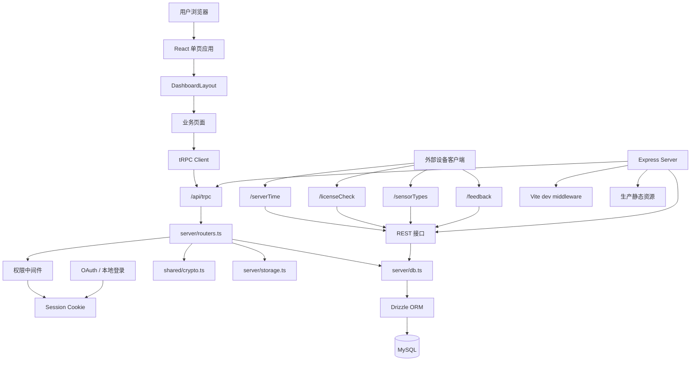
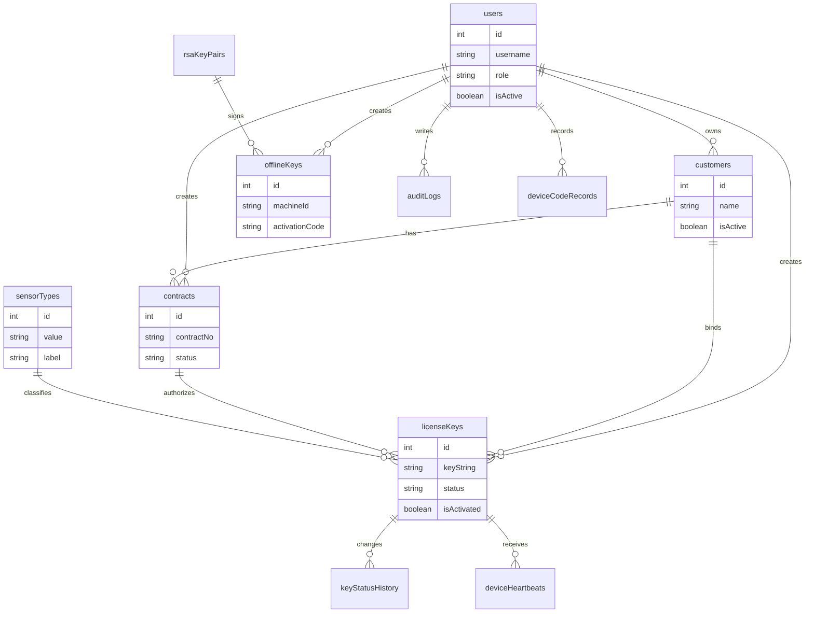
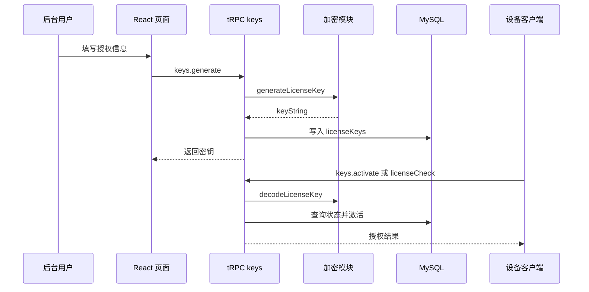
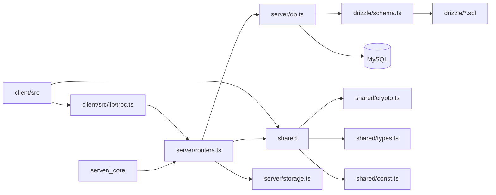

# Key Manager 架构图

## 总览
- 系统定位
	- 授权密钥管理
	- 传感器类型管理
	- 客户合同管理
	- 设备心跳监控
	- 离线授权生成
- 技术栈
	- React 19
	- Vite 7
	- Express 4
	- tRPC 11
	- Drizzle ORM
	- MySQL
	- Tailwind CSS 4
	- Radix UI
- 运行入口
	- `server/_core/index.ts`
	- `client/src/main.tsx`
	- `client/src/App.tsx`
	- `drizzle/schema.ts`
	- `shared/crypto.ts`

## 系统架构图

## 前端
- 入口层
	- `main.tsx`
	- `App.tsx`
	- 全局样式
	- 主题上下文
- 布局层
	- `DashboardLayout`
	- 侧边导航
	- 角色菜单
	- 错误边界
	- 骨架屏
- 通信层
	- `lib/trpc.ts`
	- React Query
	- Superjson
	- Cookie 会话
- 页面层
	- 首页仪表盘
	- 在线密钥生成
	- 在线密钥列表
	- 密钥验证
	- 离线密钥生成
	- 离线密钥列表
	- 账号管理
	- 客户管理
	- 合同管理
	- 传感器类型
	- 设备报码
	- 心跳监控
	- 审计日志
	- 反馈管理
- 浏览器能力
	- Web Serial
	- MAC 读取
	- 剪贴板
	- 地图组件

## 后端
- 服务入口
	- Express 初始化
	- JSON body
	- URL encoded body
	- HTTP Server
	- 自动端口探测
- REST 接口
	- `/serverTime`
	- `/licenseCheck`
	- `/sensorTypes`
	- `/feedback`
- tRPC 接口
	- `/api/trpc`
	- `appRouter`
	- `createContext`
	- `createExpressMiddleware`
- 核心路由
	- `auth`
	- `accounts`
	- `customers`
	- `sensors`
	- `offlineKeys`
	- `keys`
	- `audit`
	- `heartbeat`
	- `contracts`
	- `deviceCodes`
	- `feedback`
- 权限模型
	- `publicProcedure`
	- `protectedProcedure`
	- `adminProcedure`
	- `superAdminProcedure`
- 启动初始化
	- 默认超级管理员
	- 默认传感器类型
	- RSA 密钥对
	- 设备报码表

## 数据架构图

## 数据层
- 数据库
	- MySQL
	- Drizzle ORM
	- SQL 迁移
	- `DATABASE_URL`
- 表结构
	- `users`
	- `customers`
	- `contracts`
	- `licenseKeys`
	- `deviceHeartbeats`
	- `sensorTypes`
	- `rsaKeyPairs`
	- `offlineKeys`
	- `keyStatusHistory`
	- `auditLogs`
	- `deviceCodeRecords`
	- `feedback`
- 访问封装
	- `getDb`
	- 用户查询
	- 密钥 CRUD
	- 客户 CRUD
	- 合同 CRUD
	- 审计记录
	- 心跳记录

## 授权流程图

## 安全边界
- 会话安全
	- JWT Secret
	- Cookie
	- 当前用户上下文
- 权限边界
	- 公开接口
	- 登录接口
	- 管理员接口
	- 超级管理员接口
- 密钥安全
	- AES-256-GCM 风格载荷
	- HMAC 校验
	- RSA-SHA256 离线签名
	- 过期检测
	- 暂停撤销
	- 篡改标记
- 数据边界
	- 分级查看
	- 创建者归属
	- 客户归属
	- 合同绑定
	- 审计追踪

## 部署结构
- 开发模式
	- `pnpm dev`
	- tsx watch
	- Vite middleware
	- Express 同端口
- 生产模式
	- `pnpm build`
	- Vite build
	- esbuild server
	- `pnpm start`
	- 静态资源托管
- 环境变量
	- `DATABASE_URL`
	- `JWT_SECRET`
	- `BUILT_IN_FORGE_API_URL`
	- `BUILT_IN_FORGE_API_KEY`
	- OAuth 配置

## 模块依赖图

## 关键文件
- 前端入口
	- `client/src/main.tsx`
	- `client/src/App.tsx`
- 前端布局
	- `client/src/components/DashboardLayout.tsx`
	- `client/src/components/ErrorBoundary.tsx`
- 前端页面
	- `client/src/pages/Home.tsx`
	- `client/src/pages/GenerateKey.tsx`
	- `client/src/pages/KeyList.tsx`
	- `client/src/pages/VerifyKey.tsx`
	- `client/src/pages/OfflineKeyGen.tsx`
	- `client/src/pages/OfflineKeyList.tsx`
- 后端入口
	- `server/_core/index.ts`
	- `server/_core/vite.ts`
	- `server/_core/context.ts`
	- `server/_core/trpc.ts`
- 后端业务
	- `server/routers.ts`
	- `server/db.ts`
	- `server/storage.ts`
- 共享模块
	- `shared/crypto.ts`
	- `shared/crypto-lib.cjs`
	- `shared/types.ts`
	- `shared/const.ts`
- 数据库
	- `drizzle/schema.ts`
	- `drizzle/relations.ts`
	- `drizzle/*.sql`
