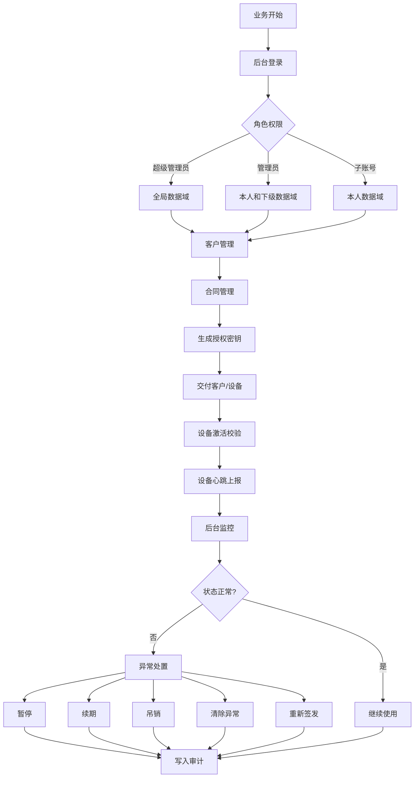
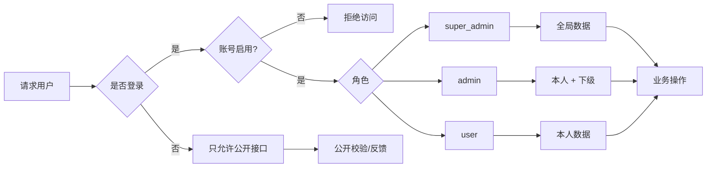
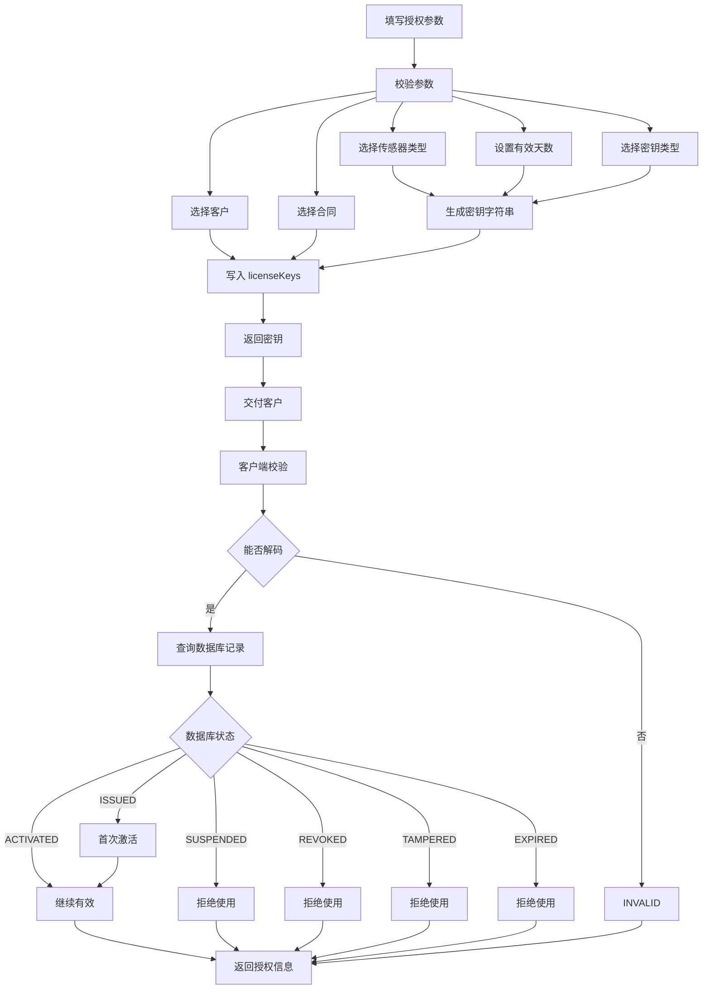
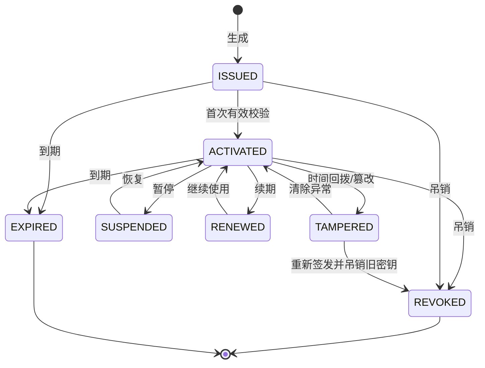
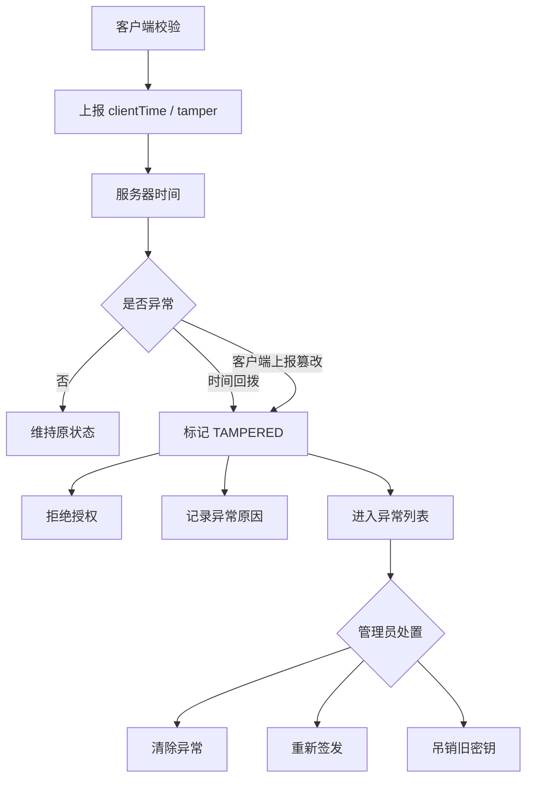
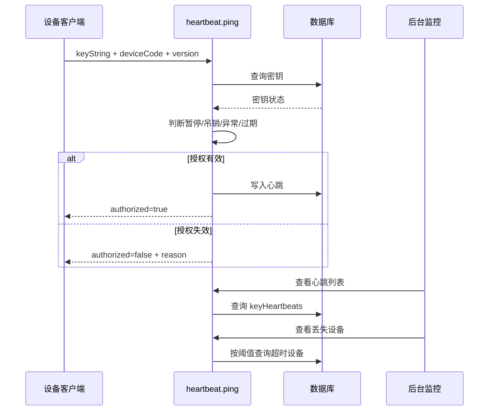
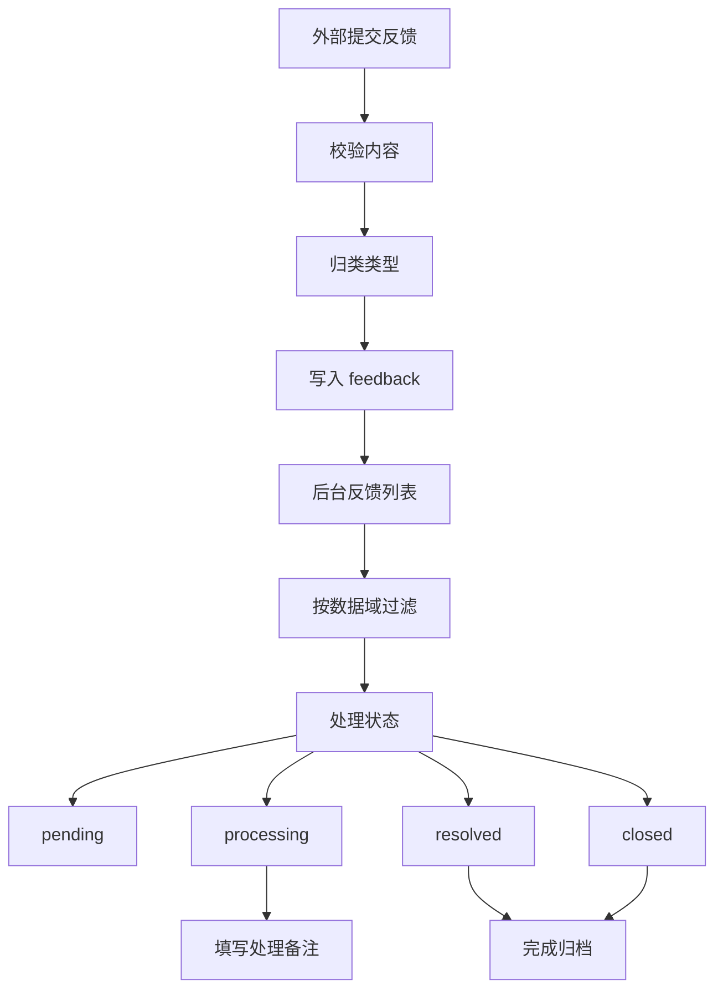

# Key Manager 业务逻辑图

## 业务总览
- 核心对象
	- 用户账号
	- 客户
	- 合同
	- 在线密钥
	- 离线密钥
	- 传感器类型
	- 设备心跳
	- 设备报码
	- 用户反馈
	- 审计日志
- 核心角色
	- 超级管理员
	- 管理员
	- 子账号
	- 外部设备客户端
- 核心闭环
	- 创建客户
	- 创建合同
	- 生成密钥
	- 客户端激活
	- 心跳续验
	- 异常处置
	- 审计追踪

## 主业务闭环

## 账号权限
- 登录入口
	- 本地账号密码
	- OAuth 回调
	- Session Cookie
- 权限分层
	- 公开接口
		- 密钥验证
		- 密钥激活
		- 服务时间
		- 传感器列表
		- 反馈提交
	- 登录用户
		- 查看个人数据域
		- 创建客户
		- 创建合同
		- 生成密钥
		- 查看密钥
	- 管理员
		- 管理下级账号
		- 暂停密钥
		- 恢复密钥
		- 吊销密钥
		- 续期密钥
		- 查看心跳
	- 超级管理员
		- 全量账号
		- 全量审计
		- 传感器类型
		- RSA 密钥对
		- 密钥类型变更
- 数据域
	- 超级管理员看全部
	- 管理员看本人和下级
	- 子账号看本人
	- 部分账号按传感器分组过滤

## 账号权限图

## 客户合同流程
- 客户管理
	- 创建客户
	- 编辑客户
	- 禁用客户
	- 删除客户
	- 删除前检查活跃密钥
- 合同管理
	- 创建合同
	- 合同编号唯一
	- 绑定客户
	- 设置数量额度
	- 设置合同状态
	- 删除前检查关联密钥
- 合同状态
	- 草稿
	- 生效
	- 过期
	- 终止
- 密钥归属
	- 绑定客户
	- 绑定合同
	- 记录合同编号
	- 记录创建人

## 在线密钥流程

## 密钥生命周期
- 初始状态
	- `ISSUED`
	- 未激活
	- 有到期时间
	- 有创建人
- 使用状态
	- 首次校验激活
	- 写入激活时间
	- 绑定设备信息
	- 返回剩余天数
- 管理状态
	- 暂停
	- 恢复
	- 续期
	- 吊销
	- 清除异常
	- 重新签发
- 终止状态
	- 过期
	- 吊销
	- 异常
- 历史记录
	- 状态变更
	- 操作人
	- 原因
	- 时间
	- 审计日志

## 密钥状态机

## 客户端校验流程
- 服务时间
	- `/serverTime`
	- 返回服务器毫秒时间
	- 客户端校时参考
- 在线校验
	- `/licenseCheck`
	- 校验密钥格式
	- 解码授权载荷
	- 查询数据库状态
	- 检测到期
	- 检测暂停
	- 检测吊销
	- 检测异常
	- 首次使用激活
- 传感器同步
	- `/sensorTypes`
	- 返回分组列表
	- 返回扁平列表
	- 返回 value-label 映射
- 反馈提交
	- `/feedback`
	- 公开提交
	- 内容截断
	- IP 记录
	- 后台处理

## 防篡改流程

## 离线密钥流程
- 生成条件
	- 机器码
	- 传感器类型
	- 有效天数
	- RSA 密钥对
- 签发过程
	- 获取活跃 RSA 密钥
	- 生成离线激活码
	- 写入离线密钥记录
	- 返回激活码
- 客户端验证
	- 使用公钥
	- 校验 RSA-SHA256 签名
	- 校验机器码
	- 校验到期时间
- 后台管理
	- 离线密钥列表
	- 离线密钥统计
	- RSA 密钥对列表
	- 生成新 RSA 密钥对

## 设备心跳流程

## 设备报码流程
- 设备类型
	- 足部设备
	- 座椅设备
	- 虚拟设备
- 读取记录
	- 插槽编号
	- 插槽名称
	- MAC 地址
	- 成功状态
	- 合同编号
	- 创建人
- 列表查看
	- 按数据域过滤
	- 按设备类型过滤
	- 分页查看
- 删除规则
	- 记录存在
	- 超级管理员可删全部
	- 非超管只能删本数据域

## 反馈处理流程

## 审计规则
- 写入场景
	- 导出密钥
	- 创建合同
	- 更新合同
	- 删除合同
	- 暂停密钥
	- 恢复密钥
	- 吊销密钥
	- 续期密钥
	- 清除异常
	- 重新签发
- 审计字段
	- 用户 ID
	- 用户名
	- 动作类型
	- 资源类型
	- 资源 ID
	- 描述
	- IP
	- User-Agent
- 查看权限
	- 超级管理员

## 业务边界
- 删除客户
	- 检查客户是否存在
	- 检查活跃密钥数量
	- 有活跃密钥则阻止
- 删除合同
	- 检查合同是否存在
	- 检查数据域权限
	- 检查活跃密钥数量
	- 有活跃密钥则阻止
- 管理账号
	- 管理员不能创建管理员
	- 管理员只能操作下级
	- 非超管不能操作超管
- 导出密钥
	- 按数据域过滤
	- 按条件过滤
	- 写入审计日志
- 反馈处理
	- 按数据域过滤
	- 管理员可删除
	- 子账号只能处理范围内反馈

## 页面到业务映射
- `Home`
	- 密钥统计
	- 异常提醒
	- 快捷入口
- `GenerateKey`
	- 在线密钥生成
	- 客户合同绑定
- `KeyList`
	- 密钥查询
	- 生命周期管理
	- 导出
- `VerifyKey`
	- 密钥解码
	- 有效性验证
- `OfflineKeyGen`
	- 离线激活码
	- RSA 签名
- `OfflineKeyList`
	- 离线记录
	- 离线统计
- `CustomerManagement`
	- 客户资料
	- 客户删除约束
- `ContractManagement`
	- 合同资料
	- 合同删除约束
- `HeartbeatMonitor`
	- 心跳列表
	- 丢失设备
- `TamperedKeys`
	- 异常密钥
	- 清除异常
	- 重新签发
- `AuditLog`
	- 操作审计
- `FeedbackManagement`
	- 反馈处理
